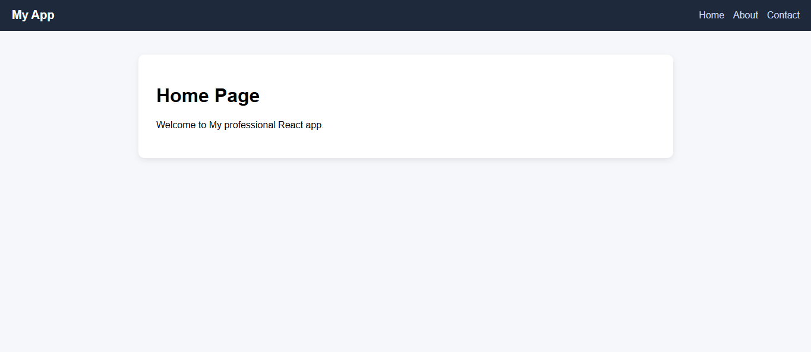
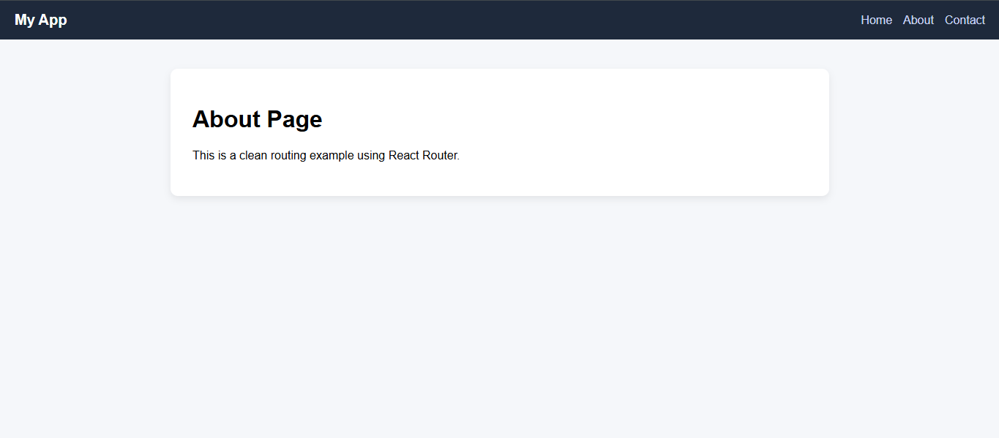
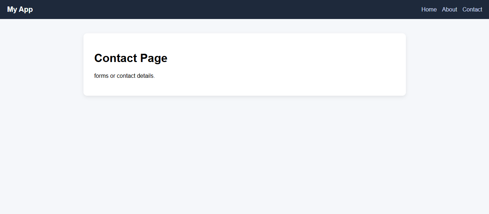

# 🚀 Client-Side Routing App (React)

A clean and simple React application demonstrating **client-side routing** using React Router.
This project showcases navigation between multiple pages without full page reloads, along with a structured UI and reusable components.

---

## 📌 Features

* 🔀 Client-side routing with React Router
* 🧭 Navigation bar with active links
* 📄 Multiple pages (Home, About, Contact)
* ⚠️ Custom 404 Not Found page
* 🎨 Clean and responsive UI design
* ⚡ Fast navigation without page refresh

---

## 🛠️ Tech Stack

* **Frontend:** React.js
* **Routing:** React Router DOM
* **Styling:** CSS3
* **Package Manager:** npm

---

## 📂 Project Structure

```
my-app/
│── src/
│   ├── pages/
│   │   ├── Home.js
│   │   ├── About.js
│   │   ├── Contact.js
│   │   └── NotFound.js
│   ├── Navbar.js
│   ├── App.js
│   ├── App.css
│   └── index.js
│
├── screenshots/
│   ├── home-page.png
│   ├── about-page.png
│   └── contact-page.png
│
├── package.json
└── README.md
```

---

## 📸 Screenshots

### 🏠 Home Page



### ℹ️ About Page



### 📞 Contact Page



---

## ⚙️ Installation & Setup

Follow these steps to run the project locally:

```bash
# Clone the repository
git clone https://github.com/Ayankhan-01/client-side-routing.git

# Navigate into the project folder
cd client-side-routing/my-app

# Install dependencies
npm install

# Start development server
npm start
```

---

## 🌐 How It Works

* The app uses **BrowserRouter** to enable routing.
* Each route maps a URL path to a React component.
* Navigation is handled using **Link** components instead of traditional anchor tags.
* React updates the UI dynamically without reloading the page.

---

## 🚀 Future Improvements

* 🔐 Add authentication & protected routes
* 📱 Improve responsiveness for mobile devices
* 🎯 Add active link highlighting
* 🌙 Dark mode support
* 📊 Convert into a dashboard layout

---

## 🙌 Acknowledgements

This project was built as part of an internship task to understand the fundamentals of **React routing and navigation**.

---

## 📧 Contact

If you have any questions or suggestions, feel free to reach out.

---

⭐ If you found this project helpful, consider giving it a star!
